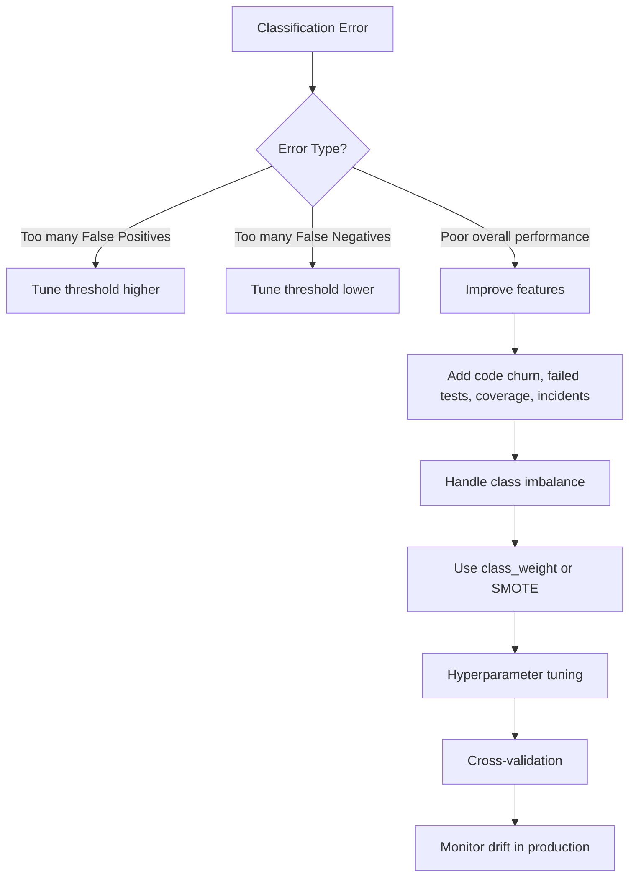
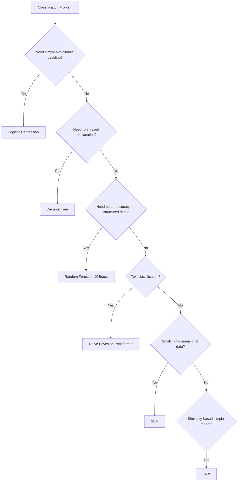
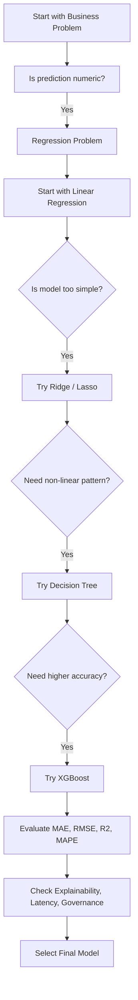

# ML Algorithms for Release Risk Prediction

This project demonstrates supervised machine learning for release-quality decisions. It supports two related goals:

- **Classification:** predict whether a release is **low risk** or **high risk**.
- **Regression:** predict the expected numeric **defect count** for a release.

The examples use measurable engineering signals to help quality, platform, and release teams prioritize validation work and make more consistent release decisions.

## Project Objective

The objective is to turn historical delivery and quality data into an early risk signal. The models support—not replace—engineering judgment by identifying releases that may need additional testing, approval, or monitoring before deployment.

## Index

1. [Problem Statement](#problem-statement)
2. [Scope and Limitations](#scope-and-limitations)
3. [Classification: Release-Risk Category](#classification-release-risk-category)
4. [Regression: Expected Defect Count](#supervised-regression-for-release-risk-prediction)
5. [Quality Engineering Use Cases](#quality-engineering-and-platform-modernization-use-case)
6. [Production Adoption](#production-adoption-considerations)
7. [Future Directions](#future-directions)
8. [Setup and Run](#setup)

## Scope and Limitations

### In Scope

- Supervised classification of releases into low-risk and high-risk categories
- Supervised regression to estimate a release's defect count
- Comparison of baseline, regularized, tree-based, and boosting models
- Evaluation, threshold tuning, cross-validation, explainability, and governance guidance
- Sample datasets that demonstrate the end-to-end workflow

### Out of Scope

- Automated release approvals or blocking deployments without human review
- Direct production integrations with GitHub, Jira, CI/CD tools, or New Relic
- A production-grade feature store, model registry, API service, or monitoring platform

### Current Limitations

The included datasets are intentionally small and embedded in the scripts for learning. Results are illustrative only. A real implementation needs larger, representative historical data, consistent feature definitions, security controls, and ongoing validation.

## Problem Statement

Engineering teams need to decide whether a release is safe to deploy. Those decisions often rely on separate and inconsistently reviewed signals, including code churn, failed tests, test coverage, previous incidents, deployment frequency, and production alerts.

Without a consistent approach, high-risk releases may receive insufficient validation while low-risk releases may be delayed unnecessarily. This project applies supervised classification to combine historical delivery and quality signals into a clear release-risk class: `low_risk` or `high_risk`.

## Classification: Release-Risk Category

### How the Problem Is Solved

The model learns from historical releases with known outcomes. Each release is represented by engineering metrics, while its historical risk classification becomes the target label.

1. Collect historical release and quality data.
2. Create features such as code churn, failed tests, test coverage, previous incidents, deployment frequency, and production alerts.
3. Label each historical release as low risk or high risk.
4. Split the dataset into training and test sets.
5. Train a Logistic Regression baseline and compare it with Decision Tree, Random Forest, and XGBoost-style models.
6. Evaluate predictions using classification metrics.
7. Tune the decision threshold and select a model that balances accuracy, explainability, latency, and governance needs.
8. Monitor production performance and data drift after deployment.

The model is a decision-support tool. Release owners remain responsible for the final deployment decision.

### Measures Taken to Solve the Problem

| Measure | Purpose |
| --- | --- |
| Feature engineering | Convert delivery, testing, and incident signals into consistent model inputs |
| Baseline model | Start with Logistic Regression for an explainable reference point |
| Model comparison | Compare Decision Tree, Random Forest, and XGBoost-style models against the baseline |
| Train/test evaluation | Measure how well the model generalizes to releases it has not seen |
| Threshold tuning | Balance false positives and false negatives for the release workflow |
| Class imbalance handling | Use `class_weight` or SMOTE when high-risk releases are underrepresented |
| Hyperparameter tuning | Improve model performance without overfitting |
| Cross-validation | Validate results across multiple data splits |
| Explainability | Show the signals contributing to a high-risk prediction |
| Production monitoring | Track drift, prediction quality, latency, and scoring failures |
| Governance | Document model purpose, limitations, approvals, ownership, and audit requirements |

### Improving Classification Performance



### When to Use Each Classification Algorithm



| Algorithm | When to Use It |
| --- | --- |
| Logistic Regression | A simple, fast, explainable baseline for binary classification |
| Decision Tree | Clear rule-based explanations are important |
| Random Forest | Better accuracy and stability are needed for structured data |
| XGBoost | High predictive performance is required for larger structured datasets |
| Naive Bayes | A simple baseline is needed for text classification |
| Transformer | Text classification requires deeper language understanding and sufficient data |
| SVM | The dataset is small with many input dimensions |
| KNN | A simple similarity-based approach is suitable and inference scale is modest |

### Classification Model Evaluation

| Metric | Meaning |
| --- | --- |
| Accuracy | Overall proportion of correct predictions; use carefully with imbalanced data |
| Precision | Of releases predicted high risk, the proportion that were actually high risk |
| Recall | Of truly high-risk releases, the proportion correctly identified |
| F1 Score | Balance between precision and recall |
| ROC-AUC | Ability to rank high-risk releases above low-risk releases across thresholds |
| Confusion Matrix | Counts true positives, false positives, true negatives, and false negatives |

For release-risk prediction, recall is often important because missing a genuinely high-risk release can lead to a production incident. Precision is also important so teams do not spend excessive effort investigating false alarms. The right balance depends on the organization’s risk tolerance.

### Classification Examples

| Release Scenario | Example Signals | Suggested Classification Outcome | Team Action |
| --- | --- | --- | --- |
| Low-risk release | Low code churn, no failed tests, high coverage, no recent incidents | Low risk | Follow the standard release process |
| High-risk release | High code churn, several failed tests, low coverage, recent incidents | High risk | Add regression testing and require engineering approval |
| False-positive review | Model predicts high risk, but release evidence is strong | Review threshold and feature contribution | Release with documented approval if evidence supports it |
| Missed high-risk release | Model predicts low risk, but defects occur after deployment | Review false negative and retrain with verified outcome | Improve features, threshold, and monitoring |

## Quality Engineering and Platform Modernization Use Case

In AI-enabled quality engineering and platform modernization, supervised classification can be applied to release-risk prediction, defect-prone module detection, incident prioritization, and production anomaly classification.

Potential input features include:

- GitHub code churn
- Failed test count
- Test coverage
- Previous incidents
- Deployment frequency
- New Relic alerts

The model can classify a release as low risk or high risk. The result can appear in CI/CD quality gates, release dashboards, Jira workflows, and platform-engineering reports, alongside the supporting explanation and required approval path.

## Production Adoption Considerations

Before using a classification model in release decision workflows, teams should add:

- Explainability so users can understand why a release is considered high risk
- Threshold tuning aligned to release-risk tolerance
- Quality gates and human approval workflows
- Data and model drift monitoring
- Model governance, ownership, security controls, and audit records
- Ongoing retraining based on verified release outcomes

## Supervised Regression for Release Risk Prediction

Classification answers a category question, such as whether a release is low risk or high risk. Regression answers a numeric question, such as **how many defects a release is likely to have**. Both approaches can be useful in a release-quality workflow.

### Regression Problem Statement

Quality and release teams need an early estimate of the likely defect count for an upcoming release. Reviewing code churn, test results, coverage, prior incidents, deployment frequency, and production alerts manually is slow and can vary from team to team.

This regression approach learns from historical release data and predicts a numeric `defect_count`. The estimate helps teams identify releases that may need additional testing, approval, or monitoring before deployment.

### How the Regression Problem Is Solved

1. Collect historical release records and their verified defect counts.
2. Build features from code churn, failed test count, test coverage, previous incidents, deployment frequency, and New Relic production alerts.
3. Use the historical `defect_count` as the numeric target.
4. Split the data into training and test datasets.
5. Train a Linear Regression baseline.
6. Compare Ridge, Lasso, Decision Tree, and XGBoost-style boosting models.
7. Evaluate prediction error and select a model suitable for production.
8. Monitor model quality and drift as new release data arrives.

### Regression Model Selection Logic



### Regression Models Compared

| Model | Purpose | Important Parameters to Tune |
| --- | --- | --- |
| Linear Regression | Simple and explainable baseline | Usually no model hyperparameters; focus on feature quality and scaling |
| Ridge Regression | Reduces overfitting from correlated features with L2 regularization | `alpha` |
| Lasso Regression | Reduces overfitting and can remove less useful features with L1 regularization | `alpha`, `max_iter` |
| Decision Tree Regressor | Captures non-linear feature relationships | `max_depth`, `min_samples_split`, `min_samples_leaf`, `max_features` |
| XGBoost-style boosting | Can improve accuracy on complex structured data | `n_estimators`, `learning_rate`, `max_depth`, `subsample`, `colsample_bytree`, `reg_alpha`, `reg_lambda` |

The existing example uses scikit-learn Gradient Boosting as an XGBoost-style boosting model. If using the separate XGBoost library, add `xgboost` to `requirements.txt` and use `XGBRegressor`.

### Regression Model Evaluation

| Metric | What It Measures | Better Result |
| --- | --- | --- |
| MAE | Average absolute difference between predicted and actual defect count | Lower |
| RMSE | Error measure that penalizes large prediction mistakes more heavily | Lower |
| R2 Score | How much variation in defect count the model explains | Higher |
| MAPE | Average percentage error; avoid or handle carefully when actual defect counts can be zero | Lower |

Use the same validation data for each model so their MAE, RMSE, R2, and MAPE results are comparable. Cross-validation provides a more reliable estimate when the historical dataset is small.

### Regression Model Tuning Process

1. Start with Linear Regression to establish an understandable baseline.
2. Scale numerical features before using Ridge or Lasso, then tune `alpha` with cross-validation.
3. Tune Decision Tree depth and minimum sample settings to avoid memorizing the training data.
4. Tune boosting parameters gradually: begin with `n_estimators`, `learning_rate`, and `max_depth`; then assess sampling and regularization parameters.
5. Compare cross-validation results and test-set metrics, not training accuracy alone.
6. Select the simplest model that meets the error, latency, explainability, and governance requirements.

### Regression Examples

| Release Scenario | Example Signals | Possible Regression Outcome | Team Action |
| --- | --- | --- | --- |
| Stable release | Low churn, strong coverage, no failed tests | Low predicted defect count | Use normal testing and deployment controls |
| Complex release | High churn, failed tests, low coverage, previous incidents | High predicted defect count | Add targeted testing and release approval checks |
| Large prediction error | Actual defects differ substantially from prediction | High MAE or RMSE for that release | Review data quality, update features, and retrain |

### Enterprise Use Case

In quality engineering and AI platform work, this model-comparison approach can estimate release risk or defect count from delivery and production signals. A higher predicted defect count can trigger extra regression testing, a quality gate, engineering approval, or enhanced New Relic monitoring after deployment.

XGBoost may provide stronger accuracy for complex data, but production adoption also requires explainability, quality gates, monitoring, drift detection, governance, ownership, and human oversight.

## Future Directions

The next steps for evolving this project into a practical platform capability are:

1. Replace embedded data with governed historical data from GitHub, CI/CD systems, test platforms, Jira, incident tools, and New Relic.
2. Add deployment frequency, pull-request size, code complexity, service ownership, and post-release alert features.
3. Use time-aware cross-validation so models are evaluated on future releases rather than random historical splits.
4. Add automated hyperparameter searches and experiment tracking for repeatable model comparisons.
5. Provide explainability reports, such as feature importance and release-level reason codes.
6. Deploy a scoring API or CI/CD integration that surfaces risk before release approval.
7. Monitor prediction quality, feature drift, model drift, latency, and scoring failures in production.
8. Establish retraining cadence, model ownership, approval workflows, and audit evidence.

## Conclusion

For classification, start with a Logistic Regression baseline, then compare Decision Tree, Random Forest, and XGBoost-style models. For numeric defect-count prediction, start with Linear Regression, then compare Ridge, Lasso, Decision Tree, and XGBoost-style boosting models.

For production adoption, add explainability, threshold tuning where applicable, quality gates, drift monitoring, and governance before using either model in release decision workflows.

## Project Structure

```text
.
├── README.md
├── requirements.txt
├── supervised_classification_algorithm.py
├── supervised_regression_ml.py
└── .gitignore
```

## Setup

```bash
python3 -m venv venv
source venv/bin/activate
pip install -r requirements.txt
```

## Run

```bash
python supervised_classification_algorithm.py
```

Run the regression comparison:

```bash
python supervised_regression_ml.py
```
